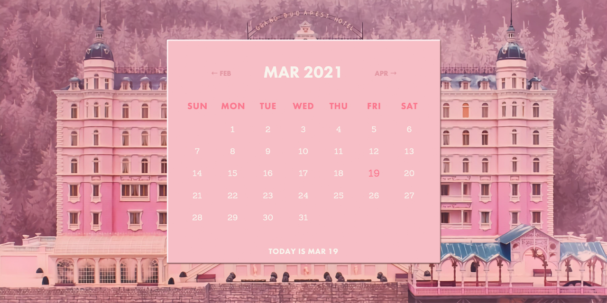

<p id="header"><p>

<table><tr>
<td> <a href="https://github.com/emjose/toast-notifications/#header"></a> </td>
<td> <a href="https://github.com/emjose/one-hundred/#header"></a> </td>
<td> <a href="https://github.com/emjose/mousetrail-particle1/#header"></a> </td>
</tr></table>

<br>

<p id="project-title"><p>

<a href=#table-of-contents></a>

<br>

<a href="https://emjose.github.io/budapest-calendar/"></a>

#

<p id="table-of-contents"><p>

<a href=#table-of-contents></a>

-   [100 Days of Code](#100days)
-   [Installation](#installation)
-   [Live Site](#live-site)
-   [Resources](#resources)
-   [Copyright](#copyright)
-   [Let's Connect!](#lets-connect)

<br>

#

<p id="100days"><p>

<a href=#100days></a>

### Day 23: March 5, 2021

-   I gave a Wes Anderson makeover to a <a href="https://codepen.io/ovdojoey/pen/GqRxYQ">calendar CodePen</a> by <a href="https://joeylea.com/">Joey Lea</a>.

-   The calendar is themed after one of my favorite films, <a href="https://www.searchlightpictures.com/thegrandbudapesthotel/">The Grand Budapest Hotel</a>.

-   Events can be added, and it has <a href="https://www.imdb.com/title/tt2278388/characters/nm0000146">quotes from Monsieur Gustave</a>, portrayed by the actor <a href="https://www.imdb.com/name/nm0000146/">Ralph Fiennes</a>.

-   **September 2022 Update**: For accessibility, the light text colors were changed to darker hues.

<br>

#

<p id="installation"><p>

<a href=#installation></a>

#### 1. Git clone and cd into the repo folder:

```console
git clone git@github.com:emjose/budapest-calendar.git && cd budapest-calendar
```

#### 2. Run the command:

```console
open index.html
```

<br>

#

<p id="live-site"><p>

<a href="https://emjose.github.io/budapest-calendar/"></a>

<a href="https://emjose.github.io/budapest-calendar/"></a>

• The **[Calendar](https://emjose.github.io/budapest-calendar/)** is a [progressive web app](https://developer.mozilla.org/en-US/docs/Web/Progressive_web_apps).

• Users can browse calendar dates and quotes from Ralph Fiennes' character, Monsieur Gustave.

• **Note**: The original white and light pink text colors have been changed to darker hues for greater accessibility.

#

<br>

<a href="https://emjose.github.io/budapest-calendar/"></a>

• Events can be added and deleted.

• **Note**: The original white and light pink text colors have been changed to darker hues for greater accessibility.

<br>

#

<p id="resources"><p>

<a href=#resources></a>

-   #### [Calendar CodePen](https://codepen.io/ovdojoey/pen/GqRxYQ) by [Joey Lea](https://joeylea.com/)

-   #### [The Grand Budapest Hotel](https://www.searchlightpictures.com/thegrandbudapesthotel/)

-   #### [Image Color Picker](https://imagecolorpicker.com/en)

-   #### [Monsieur Gustave Quotes](https://www.imdb.com/title/tt2278388/characters/nm0000146)

-   #### [The Grand Budapest Hotel image by WallpaperCave](https://wallpapercave.com/the-grand-budapest-hotel-wallpapers)

-   #### [My blog on how I created my Github READMEs](https://emmanueljose.medium.com/readme-a-makeover-story-b9c7be37a6de?sk=7ae6623d365409d875753e4604e42ffd)

<br>

#

<p id="copyright"><p>

<a href=#copyright></a>

-   This project is for made for educational purposes only.

-   The Grand Budapest images and characters are copyright of <a href="https://www.searchlightpictures.com/">Searchlight Pictures</a>. © 20th CENTURY STUDIOS. All Rights Reserved.

<br>

#

<p id="lets-connect"><p>

<a href=#lets-connect></a>

<p><a href="https://twitter.com/Emmanuel_Labor"></a> <a href="https://www.linkedin.com/in/emmanuelpjose/"></a> <a href="https://emmanueljose.medium.com/"></a> <a href="https://www.instagram.com/emmanuel_jose/"></a> <a href="mailto:emjose@gmail.com"></a> <a href="https://www.emmanuel-jose.com/"></a> <a href="https://github.com/emjose"></a></p>

#

<a href=#header></a>
